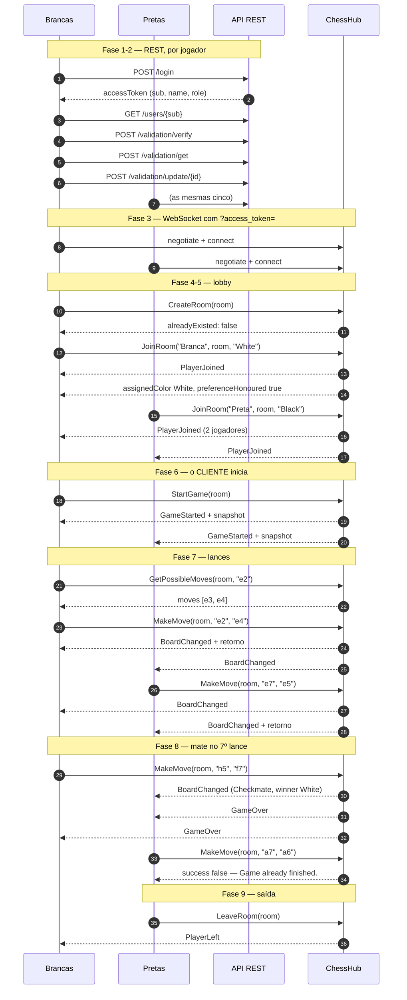

# Fluxo completo de requisições e respostas — dois jogadores

Sequência real de uma partida do login ao xeque-mate, com dois jogadores em contextos separados.

**Todos os payloads deste documento foram capturados de uma execução real** contra a API em
`http://localhost:5001` com MongoDB local, usando dois clientes SignalR de verdade. Nada foi
transcrito de DTO nem inventado. Onde algo parece estranho, é porque é assim que o sistema
responde hoje — e as inconsistências estão listadas em
[observações](#observações-e-inconsistências-reais).

- [Atores e convenções](#atores-e-convenções)
- [Fase 1 — autenticação (REST)](#fase-1--autenticação-rest)
- [Fase 2 — o que o lobby faz antes de entrar (REST)](#fase-2--o-que-o-lobby-faz-antes-de-entrar-rest)
- [Fase 3 — conexão ao hub (WebSocket)](#fase-3--conexão-ao-hub-websocket)
- [Fase 4 — lobby: criar e listar](#fase-4--lobby-criar-e-listar)
- [Fase 5 — entrar na sala](#fase-5--entrar-na-sala)
- [Fase 6 — iniciar a partida](#fase-6--iniciar-a-partida)
- [Fase 7 — consultar e jogar](#fase-7--consultar-e-jogar)
- [Fase 8 — xeque-mate e encerramento](#fase-8--xeque-mate-e-encerramento)
- [Fase 9 — sair](#fase-9--sair)
- [Catálogo de recusas](#catálogo-de-recusas)
- [Observações e inconsistências reais](#observações-e-inconsistências-reais)
- [Diagrama da sequência](#diagrama-da-sequência)

---

## Atores e convenções

| Ator | Usuário | Cor | `connectionId` da captura |
|---|---|---|---|
| **B** (brancas) | `branca@hibrygame.local` | White | `jQ35gpTrc-Xf_vGmTDiEXg` |
| **P** (pretas) | `preta@hibrygame.local` | Black | `uZgp1LJr7WnmZwY_mzRTVQ` |
| **T** (terceiro) | `extra@hibrygame.local` | — | usado só nos casos de recusa |

Base REST: `http://localhost:5001`. Hub: `ws://localhost:5001/chesshub`.
Sala da captura: `doc-1785684911839`.

**Duas serializações diferentes, e isso importa.** As respostas REST passam por
`ReferenceHandler.Preserve` e vêm com `$id` e `$values`; os payloads do hub **não**. O mesmo
conceito chega ao cliente em dois formatos, e o frontend precisa lidar com os dois.

**Sobre a ordem dos eventos.** Um `SendAsync` para o grupo é despachado *durante* a execução do
método do hub, então o evento chega ao cliente **antes** do valor de retorno da invocação. Nos
trechos abaixo o evento aparece antes da resposta por esse motivo — não é erro de transcrição.

---

## Fase 1 — autenticação (REST)

Cada jogador faz login no seu próprio contexto. Nenhum token é compartilhado.

### `POST /login` — anônimo

```json
{
  "email": "branca@hibrygame.local",
  "password": "Xadrez@2026"
}
```

**200**

```json
{
  "$id": "1",
  "success": true,
  "accessToken": "eyJhbGciOiJIUzI1NiIsInR5cCI6IkpXVCJ9.eyJzdWIiOiI3YjE4YzExZS0xYTU3LTRlMGMtYjFkNy1mNDc0YzhjN2Y5OTgi...",
  "refreshToken": "<64 bytes em base64>"
}
```

Claims do `accessToken`, decodificadas da captura:

```json
{
  "sub": "7b18c11e-1a57-4e0c-b1d7-f474c8c7f998",
  "email": "branca@hibrygame.local",
  "name": "Branca",
  "http://schemas.microsoft.com/ws/2008/06/identity/claims/role": "jogador",
  "jti": "c3f0bb84-c27e-4aba-9902-c32e230fd8f8",
  "exp": 1785688514,
  "iss": "https://localhost:5001",
  "aud": "https://localhost:5001"
}
```

Três coisas a notar:

- O papel vem na URI longa de schema, não em `"role"`. É consequência de
  `MapInboundClaims = false` com `ClaimTypes.Role`. Quem lê a claim no cliente tem de usar a URI.
- `sub` é o `userId`, e é ele que as chamadas de validação exigem no corpo — o servidor compara
  com o `sub` do token e responde 403 se divergirem.
- `exp` é 60 min por padrão (`Jwt:ExpiresMinutes`).

O mesmo par de requisição/resposta acontece para `preta@hibrygame.local`, devolvendo
`sub = 50d0fd49-f84e-4cb6-8709-30a857d24e2b`.

> **Cadastro**, quando o jogador é novo: `POST /register` com
> `{ "name", "email", "password", "passwordConfirmation" }`. É anônimo, o servidor fixa papel
> `jogador` e autor `self-registration`, e devolve sessão pronta. `POST /users` é o caminho
> administrativo e exige `Role:Admin`.

---

## Fase 2 — o que o lobby faz antes de entrar (REST)

Quatro chamadas por jogador, todas com `Authorization: Bearer <accessToken>`. Esta é a sequência
que `useChessLobby.joinRoom` executa **antes** de invocar o hub — se qualquer uma falhar, a entrada
é abortada.

### 2.1 `GET /users/{sub}`

Sem corpo. **200**:

```json
{
  "$id": "1",
  "id": "7b18c11e-1a57-4e0c-b1d7-f474c8c7f998",
  "name": "Branca",
  "email": "branca@hibrygame.local",
  "role": "jogador",
  "mustChangePassword": false,
  "assignments": { "$id": "2", "$values": [] }
}
```

O `name` daqui é o que vai como `playerName` no `JoinRoom`. Note o `$values` — artefato do
`Preserve` que o cliente precisa desembrulhar.

### 2.2 `POST /validation/verify`

```json
{ "userId": "7b18c11e-1a57-4e0c-b1d7-f474c8c7f998" }
```

**200** → `{ "$id": "1", "valid": true }`

### 2.3 `POST /validation/get`

```json
{ "userId": "7b18c11e-1a57-4e0c-b1d7-f474c8c7f998" }
```

**200**

```json
{
  "$id": "1",
  "id": "6b866969-a020-45a5-8c74-1221d3d9bc65",
  "userId": "7b18c11e-1a57-4e0c-b1d7-f474c8c7f998",
  "userEmail": "branca@hibrygame.local",
  "room": null,
  "pieceColor": null,
  "dayOfGame": "2026-08-02T15:35:14.4265642Z"
}
```

`room` e `pieceColor` vêm nulos até o jogador entrar em alguma sala. **404** quando não existe
registro de validação — o cliente trata como "sem registro" e segue, não como erro.

### 2.4 `POST /validation/update/{validationId}`

```json
{
  "pieceColor": "white",
  "room": "doc-1785684911839",
  "userEmail": "branca@hibrygame.local",
  "userId": "7b18c11e-1a57-4e0c-b1d7-f474c8c7f998"
}
```

**200** → `{ "$id": "1", "updated": true }`

`pieceColor` vai em minúsculas aqui, e em PascalCase no hub (`"White"`). São contratos distintos
para o mesmo dado.

> Todos os endpoints de validação são **POST com o id no corpo**, nunca GET com token na URL. Foi
> decisão de segurança: token em query string vaza em log de servidor e histórico de navegador.

---

## Fase 3 — conexão ao hub (WebSocket)

O hub exige `[Authorize(Policy = "Role:Player")]`. WebSocket não carrega header customizado, então
o token vai por query string, e o backend só o aceita nessa forma **para o caminho `/chesshub`** —
os endpoints REST continuam exigindo header.

```
GET /chesshub/negotiate?negotiateVersion=1&access_token=<accessToken>
```

Cada jogador abre a própria conexão e recebe um `connectionId`, que é a identidade dele dentro da
sala pelo resto da partida:

```
B -> jQ35gpTrc-Xf_vGmTDiEXg
P -> uZgp1LJr7WnmZwY_mzRTVQ
```

Eventos que o cliente precisa registrar antes de invocar qualquer coisa: `PlayerJoined`,
`PlayerLeft`, `RoomFull`, `RoomNotFound`, `GameStarted`, `BoardChanged`, `GameOver`.

---

## Fase 4 — lobby: criar e listar

### `CreateRoom(room)` — B

```
=> CreateRoom("doc-1785684911839")
<= { "room": "doc-1785684911839", "alreadyExisted": false }
```

Chamando outra vez com o mesmo nome: `"alreadyExisted": true`, sem erro. É como o lobby distingue
"criei" de "já existia".

### `GetAvailableRooms()` — B

```
=> GetAvailableRooms()
<= ["doc-1785684911839"]
```

Lista só salas com `!IsFull && !Finished`. Sala cheia desaparece daqui — é assim que um terceiro
simplesmente não vê a partida em andamento.

### `GetPlayersInRoom(room)` — B

```
=> GetPlayersInRoom("doc-1785684911839")
<= 0
```

Devolve a **contagem**, não a lista, apesar do nome. Ver
[observações](#observações-e-inconsistências-reais).

---

## Fase 5 — entrar na sala

### `JoinRoom(playerName, room, preferredColor)` — B

O evento chega antes da resposta, como explicado acima.

```
<= PlayerJoined (para o grupo, incluindo quem entrou)
{
  "room": "doc-1785684911839",
  "player": "Branca",
  "color": "White",
  "players": [ { "name": "Branca", "color": "White" } ]
}

=> JoinRoom("Branca", "doc-1785684911839", "White")
<= {
  "connectionId": "jQ35gpTrc-Xf_vGmTDiEXg",
  "player": "Branca",
  "room": "doc-1785684911839",
  "color": "White",
  "assignedColor": "White",
  "preferenceHonoured": true
}
```

### `JoinRoom` — P

```
<= PlayerJoined (os DOIS clientes recebem)
{
  "room": "doc-1785684911839",
  "player": "Preta",
  "color": "Black",
  "players": [
    { "name": "Preta", "color": "Black" },
    { "name": "Branca", "color": "White" }
  ]
}

=> JoinRoom("Preta", "doc-1785684911839", "Black")
<= {
  "connectionId": "uZgp1LJr7WnmZwY_mzRTVQ",
  "player": "Preta",
  "room": "doc-1785684911839",
  "color": "Black",
  "assignedColor": "Black",
  "preferenceHonoured": true
}
```

**O servidor é a autoridade sobre a cor.** O cliente *pede* em `preferredColor` e guarda o que
`assignedColor` devolver. Quando a cor pedida está tomada, capturado de verdade:

```
=> JoinRoom("Preta", "err-...", "White")     // pediu brancas, já tomadas
<= { ..., "color": "Black", "assignedColor": "Black", "preferenceHonoured": false }
```

`preferenceHonoured: false` é o gancho para avisar o jogador que ele vai jogar do outro lado.

---

## Fase 6 — iniciar a partida

**`JoinRoom` não inicia a partida.** Quem chama `StartGame` é o cliente, a cada `PlayerJoined` —
e é por isso que o método é serializado no servidor: os dois clientes chamam praticamente juntos.
Chamar duas vezes é seguro.

Com um jogador só:

```
=> StartGame("err-...")
<= { "success": false, "message": "Room needs 2 players to start.", "snapshot": null }
```

Com a sala cheia:

```
<= GameStarted (para o grupo) — o snapshot inteiro
=> StartGame("doc-1785684911839")
<= { "success": true, "message": null, "snapshot": { ...64 casas... } }
```

### Formato do snapshot

```json
{
  "room": "doc-1785684911839",
  "currentTurn": "White",
  "started": true,
  "finished": false,
  "outcome": "InProgress",
  "squares": [ /* 64 entradas, 32 com peça no início */ ]
}
```

Cada casa:

```json
{
  "file": "a",
  "rank": 8,
  "algebraic": "a8",
  "row": 0,
  "column": 0,
  "squareColor": "White",
  "piece": { "type": "Rook", "color": "Black", "isInCheckState": false }
}
```

Casa vazia traz `"piece": null`. Verificado na captura: **64 casas, 32 com peça**.

Coordenadas duplas, e a relação entre elas não é intuitiva: `file = 'a' + row` e
`rank = 8 - column`. Ou seja, `column = 0` é a **oitava** fileira (fundo das pretas) e
`column = 7` é a primeira (fundo das brancas). `outcome` é `InProgress | Checkmate | Stalemate`.

---

## Fase 7 — consultar e jogar

### `GetPossibleMoves(room, from)` — B

```
=> GetPossibleMoves("doc-1785684911839", "e2")
<= {
  "success": true,
  "message": null,
  "from": "e2",
  "moves": [
    { "file": "e", "rank": 3, "algebraic": "e3", "row": 4, "column": 5, "squareColor": "Black", "piece": null },
    { "file": "e", "rank": 4, "algebraic": "e4", "row": 4, "column": 4, "squareColor": "White", "piece": null }
  ]
}
```

Devolve casas completas, não só coordenadas. O servidor recalcula sempre — a resposta é sugestão
para a interface destacar, e **não** é aceita como prova de legalidade no `MakeMove`.

### `MakeMove(room, from, to)` — B

```
<= BoardChanged (para o grupo)
{
  "from": "e2",
  "to": "e4",
  "byColor": "White",
  "nextTurn": "Black",
  "outcome": "InProgress",
  "winner": null,
  "snapshot": { ...64 casas... }
}

=> MakeMove("doc-1785684911839", "e2", "e4")
<= {
  "success": true,
  "message": null,
  "from": "e2",
  "to": "e4",
  "nextTurn": "Black",
  "outcome": "InProgress",
  "winner": null,
  "snapshot": { ...64 casas... }
}
```

Quem move recebe **as duas coisas**: o `BoardChanged` do grupo e o retorno da invocação, com o
mesmo snapshot. O adversário recebe só o evento.

Sequência completa do Mate do Pastor, como capturada:

| # | Ator | Lance | `nextTurn` | `outcome` |
|---|---|---|---|---|
| 1 | B | `e2→e4` | Black | InProgress |
| 2 | P | `e7→e5` | White | InProgress |
| 3 | B | `d1→h5` | Black | InProgress |
| 4 | P | `b8→c6` | White | InProgress |
| 5 | B | `f1→c4` | Black | InProgress |
| 6 | P | `g8→f6` | White | InProgress |
| 7 | B | `h5→f7` | Black | **Checkmate** |

---

## Fase 8 — xeque-mate e encerramento

O sétimo lance dispara **dois** eventos para o grupo, nesta ordem:

```
<= BoardChanged
{
  "from": "h5",
  "to": "f7",
  "byColor": "White",
  "nextTurn": "Black",
  "outcome": "Checkmate",
  "winner": "White",
  "snapshot": { "finished": true, "outcome": "Checkmate", ... }
}

<= GameOver
{
  "room": "doc-1785684911839",
  "outcome": "Checkmate",
  "winner": "White",
  "snapshot": { "finished": true, "outcome": "Checkmate", ... }
}
```

`GameOver` é redundante em conteúdo — `BoardChanged` já traz `outcome` e `winner`. Existe para que
o cliente possa reagir ao fim sem inspecionar cada mudança de tabuleiro.

Note que `nextTurn` continua `"Black"` no lance que dá mate. Não é bug: é de quem *seria* a vez.
Quem decide que o tabuleiro está inerte é `finished`/`outcome`, nunca `currentTurn`.

Depois disso, qualquer lance é recusado:

```
=> MakeMove("doc-1785684911839", "a7", "a6")
<= { "success": false, "message": "Game already finished.", ... }
```

E `GetBoardSnapshot` continua respondendo, agora com `"finished": true`.

---

## Fase 9 — sair

```
=> LeaveRoom("doc-1785684911839")
<= null

<= PlayerLeft (para quem ficou)
{
  "room": "doc-1785684911839",
  "connectionId": "uZgp1LJr7WnmZwY_mzRTVQ",
  "players": [ { "name": "Branca", "color": "White" } ]
}
```

`PlayerLeft` identifica quem saiu por `connectionId`, não por nome. O mesmo evento é emitido por
`OnDisconnectedAsync` quando a conexão cai sem `LeaveRoom`.

---

## Catálogo de recusas

Todas capturadas de execução real. O padrão é sempre `success: false` com `message`, e **nunca
exceção** — o cliente lê a mensagem, não trata erro.

| Invocação | `message` |
|---|---|
| `MakeMove` antes de a partida começar | `Game not started.` |
| `MakeMove` fora da vez | `Not your turn.` |
| `MakeMove` com peça do adversário | `That piece is not yours.` |
| `MakeMove` para destino ilegal (`e2→e5`) | `Illegal move.` |
| `MakeMove` por quem não está na sala | `You are not in this room.` |
| `MakeMove` com a partida encerrada | `Game already finished.` |
| `GetPossibleMoves` em peça do adversário | `That piece is not yours.` |
| `GetPossibleMoves` em casa vazia | `No piece on 'e4'.` |
| `GetPossibleMoves` com algébrico inválido | `Invalid square 'z9'.` |
| `StartGame` com um jogador só | `Room needs 2 players to start.` |
| `JoinRoom` em sala cheia | evento `RoomFull` + resposta com todos os campos `null` |
| `JoinRoom` em sala inexistente | evento `RoomNotFound` + resposta com campos `null` |
| `GetBoardSnapshot` de sala inexistente | `null` |

`JoinRoom` recusado devolve o objeto inteiro nulo, não `success: false`:

```json
{
  "connectionId": null, "player": null, "room": null,
  "color": null, "assignedColor": null, "preferenceHonoured": false
}
```

O cliente detecta a recusa testando `!room || !color || color === 'None'`.

---

## Observações e inconsistências reais

Encontradas ao capturar. Nenhuma foi corrigida por este documento — estão aqui para não serem
descobertas de novo, e as duas primeiras merecem virar dívida técnica.

**1. `MakeMove` em sala inexistente responde `Game not started.`** O correto seria dizer que a
sala não existe. A mensagem atual manda o cliente investigar o estado da partida quando o problema
é o nome da sala. Capturado com `MakeMove("sala-que-nao-existe", "e2", "e4")`.

**2. `GetPlayersInRoom` devolve contagem, não jogadores.** O nome promete uma lista. E para uma
sala inexistente devolve `0`, indistinguível de uma sala vazia — o cliente não consegue diferenciar
"não existe" de "está vazia".

**3. Duas serializações no mesmo sistema.** REST vem com `$id`/`$values`
(`ReferenceHandler.Preserve`); hub vem limpo. O cliente carrega código para desembrulhar um lado.

**4. `pieceColor` em minúsculas no REST, PascalCase no hub.** Mesmo dado, duas formas.

**5. Estado do hub é estático e sobrevive entre partidas.** Na captura, `GetAvailableRooms` de uma
execução devolveu uma sala criada pela execução **anterior** — `ConcurrentDictionary` estático,
sem expiração. Sala vazia abandonada fica listada para sempre. É a mesma limitação que impede
escala horizontal sem backplane de Redis.

**6. A partida não começa sozinha.** `JoinRoom` não inicia nada; o cliente tem de chamar
`StartGame` ao receber `PlayerJoined`. Um cliente que não faça isso fica numa sala cheia e inerte,
com todo lance respondendo `Game not started.` — que foi exatamente o que aconteceu na primeira
tentativa de captura, e leva alguns minutos para diagnosticar.

---

## Diagrama da sequência



---

## Como reproduzir

A captura foi feita com dois clientes `@microsoft/signalr` reais registrando cada requisição,
resposta, invocação e evento. Para refazer:

1. MongoDB de pé (`docker start xadrez`).
2. `dotnet run --project Orchestrator --no-launch-profile --urls http://localhost:5001`
3. Os usuários da tabela de atores — semeados automaticamente por
   `KrockSide/tests-e2e/global-setup.ts` via `POST /register`.

O caminho equivalente coberto por teste automatizado é `KrockSide/tests-e2e/game.spec.ts`, que
exercita a mesma sequência pelo navegador. Este documento registra a camada de protocolo que o
teste atravessa sem mostrar.
